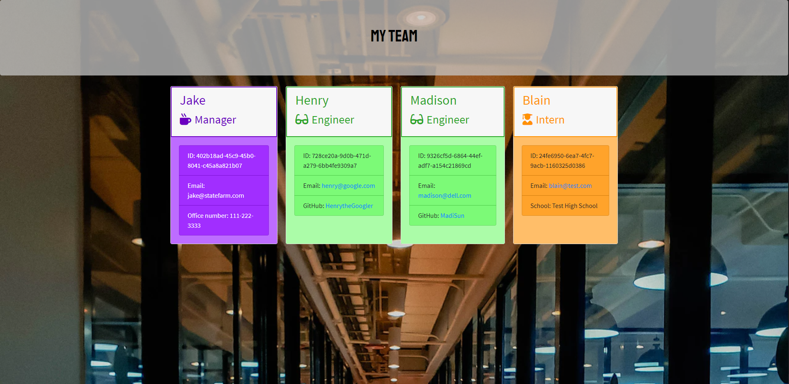
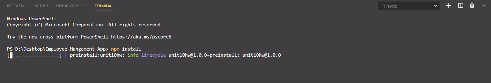
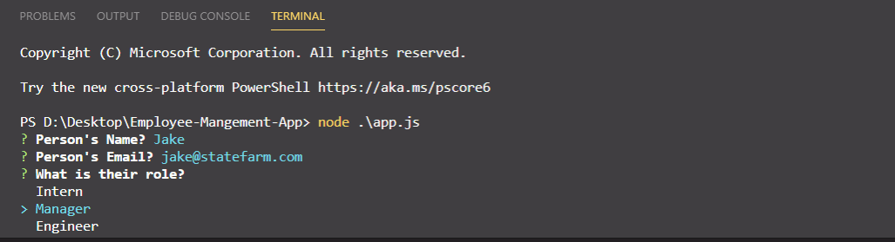

# Professional Readme Generator




## Description 

This project was built for a manager who would like a way to add employees to a webpage to have easy access to their Name, Role, Email and then some role specific data. Manager gives a phone number, Engineer gives a GitHub, and Intern gives you back their school. Right now those are the only options

## Usage

You will need to have [NodeJS](https://nodejs.org/en/) installed on your machine to run this code. Once this is done open up the app.js in terminal and type:

```
npm install
```


This will install all of the required dependencies. Then you can proceed with: 

```
node app.js
```


This will take you through prompts to generate your employees. Your options will be a Manager, Engineer or an Intern. All of these will ask you for their Name, Email, and then a role specific question. You can add as many employees as you would like. It will then generate and HTML page for you to have a simple way to see employee details.

## Credits

Website is built with Node JS

## License

Copyright (c) Allister Rampenthal. All rights reserved.

Licensed under the [MIT](https://choosealicense.com/licenses/mit/) license
